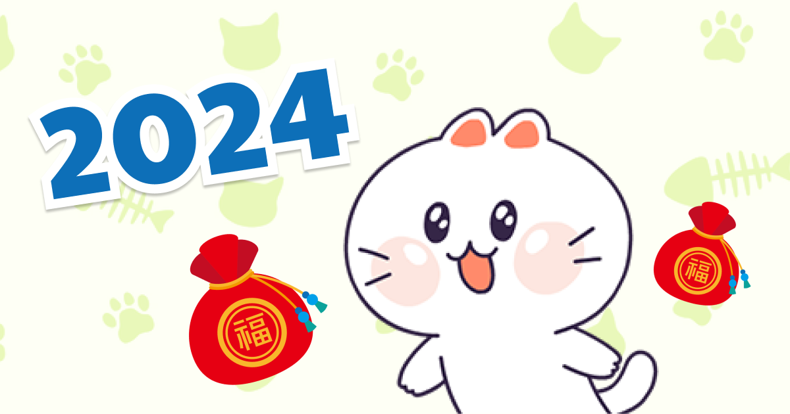
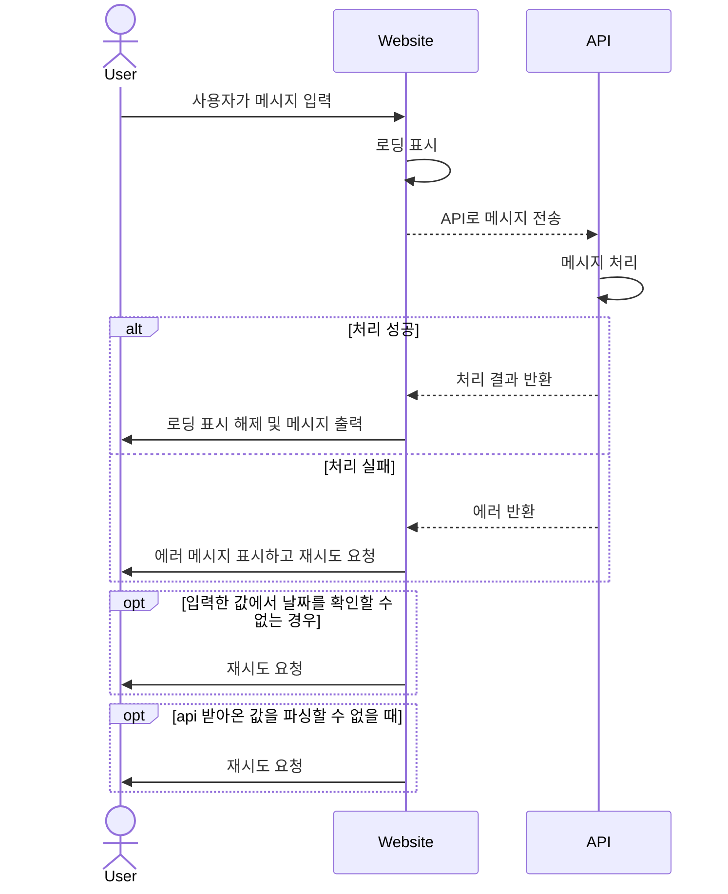
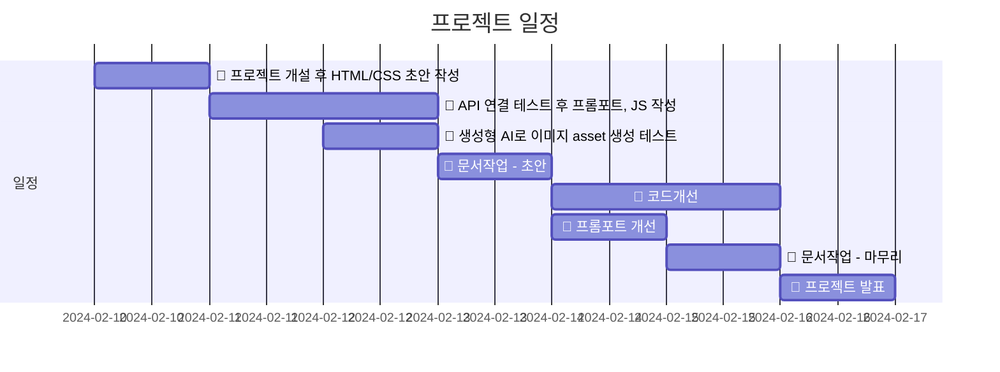
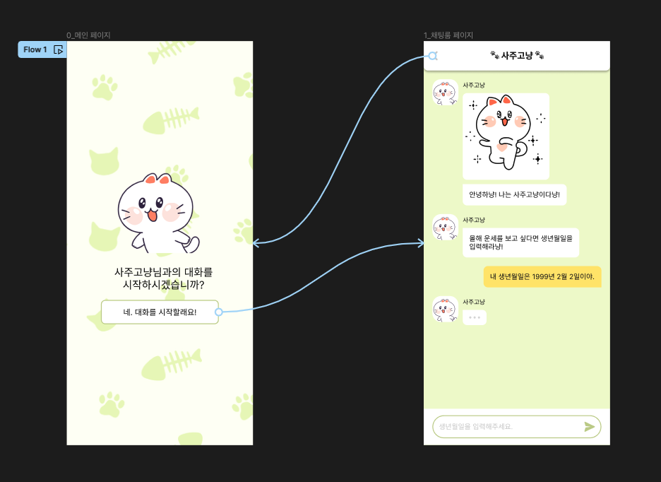
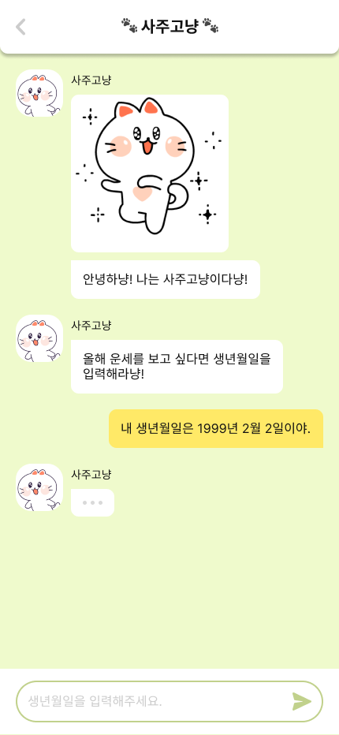
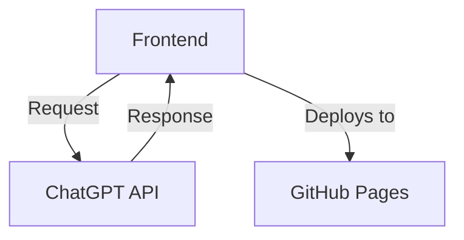

# 사주고냥


## 1. 목표와 기능
### 1.1. 목표
- 오름캠프 상반기 수업 요소를 다양하게 활용해 학습내용을 체화
    - AI
        - chatGPT api : 답변에 고양이라는 캐릭터성을 부여하고 감정표현을 추가
    - JavaScript
        - 프레임워크를 사용하지 않고 바닐라 자바스크립트로 동적 웹사이트 구현

### 1.2. 기능
- 채팅 UI를 통해 사용자의 생년월일을 입력받고 신년운세를 대화형으로 제공

## 2. 개발환경 및 배포 URL
### 2.1. 개발 환경
- 개발 환경 : HTML, CSS, JavaScript
- 서비스 배포 환경 : GitHub Page

### 2.2. 배포 URL
- https://escape1001.github.io/ormcamp/project_01

### 2.3. URL 구조
| App | URL | Views Function | HTML File Name | Note |
| --- | --- | --- | --- | --- |
| project01 | '/project01’ | welcome | /project01/index.html | 홈 화면 |
| project01 | '/project01/chatroom’ | chatroom | /project01/chatroom/index.html | 채팅 화면 |

## 3. 기능 명세



## 4. 프로젝트 구조와 개발 일정
### 4.1. 프로젝트 구조
```bash
📂project_01
├─ 📂assets
│  ├─ 📂media
│  ├─ 📂script
│  │  └─📜chatroom.js
│  └─ 📂style
│     ├─📜chatroom.css
│     ├─📜global.css
│     └─📜welcome.css
├─ 📂chatroom
│  └─ 📜index.html
└─ 📜index.html
```

### 4.2. 개발 일정(WBS)


## 5. 와이어프레임 / UI

### 5.1. 와이어프레임
[Figma - 사주고냥 와이어 프레임](https://www.figma.com/file/ofWNGMj0v0mjAA2t96KEtZ/%EC%82%AC%EC%A3%BC%EA%B3%A0%EB%83%A5?type=design&node-id=0%3A1&mode=design&t=IJlP2xiSfTRX3v1R-1)



### 5.2. 화면설계
| 메인 페이지 | 채팅룸 페이지 |
| --- | --- |
|  |  |


## 6.Architecture



## 7. 에러와 에러 해결
1. 감정이 지정된 리스트 내에서 반환되지 않아 이모티콘 불러오기에 실패하는 경우
    - `` 초기 스타일에 1px * 1px 크기 + `position:absolute;`를 적용해 사용자 눈엔 보이지 않지만 로딩할 수 있는 최소크기로 지정
    - `img.load-success` 에 UI 스타일 적용
    - `` 태그 로딩 시 해당 이미지가 `/assets/media` 폴더에 있는 경우 onLoad 이벤트 트리거됨
    - onLoad 이벤트에 `showImg` 함수 바인딩
    - `showImg`를 통해 해당 객체에 `.load-success` 클래스 추가
2. 답변 형식이 요청한 양식대로 오지 않아 파싱에 실패하는 경우
    - 프롬포트에 예시텍스트 추가해 답변이 필요한 형식으로 오도록 유도
    - 파싱 로직 내 try/catch 구문 사용해 정규식 match에 맞지 않는 경우 message만 담아 보내도록 수정

## 8. 개발하며 느낀점
1. 프롬포트 엔지니어링의 중요성 🤖
    - 초기 기획에서는 이미지 asset을 생성형 AI로 작업하고자 했으나 테스트 결과 원하는 이미지를 뽑아내기 어려웠음.
    - chatGPT api의 답변도 원하는 형식에 맞춰서 얻기가 생각보다 어려웠음.
    - AI 활용에도 스킬이 필요함을 느낌.
2. 문서작성에 자신감 씨앗을 심다 🌱
    - 비전공자로서 실무를 했을 때 장벽을 느꼈던 것 중 하나가 문서작성.
    - 이전에는 경험과 지식이 적어 고민하는 시간이 길고 확신이 없었음.
    - chatGPT + Mermaid Live 조합으로 고민의 시간을 획기적으로 줄일 수 있었다.
    - README를 완성해본 첫 경험. 앞으로 습관이 되기를 기대함. 
3. 바닐라의 재미 🍦
    - 프레임워크와 라이브러리를 쓰지 않고 완성해본 첫 프로젝트.
    - 처음 학습할 때에는 제이쿼리에 의존하고 실무 할 때에는 리액트에 의존하는 경우가 많았음.
    - 프레임워크를 쓰지 않고 작업해보니 오히려 프레임워크의 구조에 대해 호기심이 생겼다.