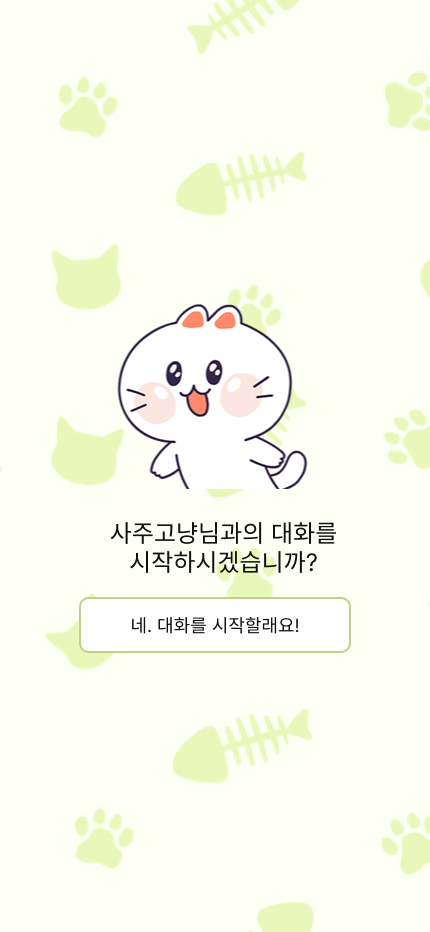

# 사주고냥


## 1. 목표와 기능
### 1.1. 목표
- 오름캠프 상반기 수업 요소를 다양하게 활용해 학습내용을 체화
    - AI
        - chatGPT api : 답변에 고양이라는 캐릭터성을 부여하고 감정표현을 추가
    - JavaScript
        - 프레임워크를 사용하지 않고 바닐라 자바스크립트로 동적 웹사이트 구현

### 1.2. 기능
- 채팅 UI를 통해 사용자의 생년월일을 입력받고 신년운세를 대화형으로 제공

## 2. 개발환경 및 배포 URL
### 2.1. 개발 환경
- 개발 환경 : HTML, CSS, JavaScript
- 서비스 배포 환경 : GitHub Page

### 2.2. 배포 URL
- https://escape1001.github.io/ormcamp/project_01

### 2.3. URL 구조
| App | URL | Views Function | HTML File Name | Note |
| --- | --- | --- | --- | --- |
| project01 | '/project01’ | welcome | project01/index.html | 홈 화면 |
| project01 | '/project01/chatroom’ | chatroom | project01/chatroom/index.html | 채팅 화면 |

## 3. 기능 명세


## 4. 프로젝트 구조와 개발 일정
### 4.1. 프로젝트 구조
```bash
📂project_01
├─ 📂assets
│  ├─ 📂media
│  ├─ 📂script
│  │  └─📜chatroom.js
│  └─ 📂style
│     ├─📜chatroom.css
│     ├─📜global.css
│     └─📜welcome.css
├─ 📂chatroom
│  └─ 📜index.html
└─ 📜index.html
```

### 4.2. 개발 일정(WBS)


## 5. 와이어프레임 / UI

### 5.1. 와이어프레임
[Figma - 사주고냥 와이어 프레임](https://www.figma.com/file/ofWNGMj0v0mjAA2t96KEtZ/%EC%82%AC%EC%A3%BC%EA%B3%A0%EB%83%A5?type=design&node-id=0%3A1&mode=design&t=IJlP2xiSfTRX3v1R-1)


### 5.2. 화면설계
- 메인 페이지



- 채팅룸 페이지


	

## 6.Architecture


## 7. 에러와 에러 해결
- [TO DO : 작성 필요]

## 8. 개발하며 느낀점
- [TO DO : 작성 필요]